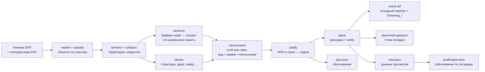
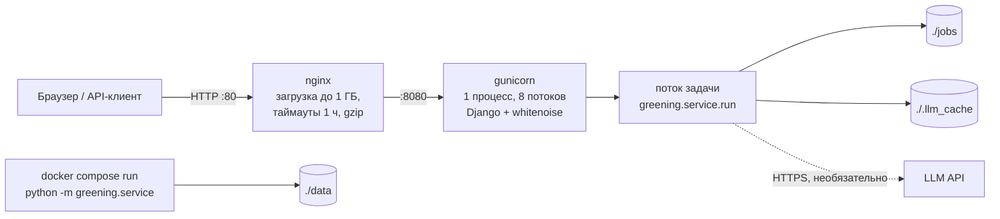
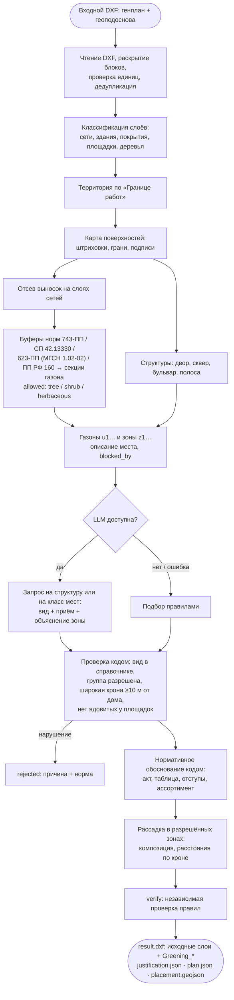

# Сервис озеленения по генплану — документация

ЛЦТ 2026, кейс 03: «Сервис для автоматического проектирования озеленения города с учётом расположения подземных коммуникаций и городской среды».

Содержание:
1. [Архитектура](#1-архитектура)
2. [Развёртывание](#2-развёртывание)
3. [HTTP API](#3-http-api)
4. [Пояснительная записка](#4-пояснительная-записка)

---

## 1. Архитектура

### 1.1. Компоненты

| Компонент | Где | Что делает |
|---|---|---|
| Конвейер `greening` | `greening/` | Модуль Python без зависимости от Django: DXF → разметка → подбор растений → рассадка → DXF. Запускается из CLI (`python -m greening.service`) и из веб-сервиса. |
| Веб-сервис | `config/`, `core/` | Django: страница загрузки, фоновые задачи, выдача результатов, просмотр, Swagger UI. |
| Фоновые задачи | `core/jobs.py` | Поток на задачу, одновременно считается одна (`GREENING_JOBS`). Состояние — `jobs/<id>/status.json`, результаты — `jobs/<id>/out/`. |
| Просмотр | `core/static/core/viewer.js` | Полноэкранная карта результата: слои, структуры, карточки посадок и зон с обоснованиями. |
| Справочники и нормы | `greening/config/` | `layers.json` — классы слоёв DXF; `norms.json` — нормативные отступы; `placement.json` — правила рассадки; `plants.txt`, `herbaceous.csv` — справочник растений (370 видов). |
| LLM (внешняя, необязательна) | OpenAI-совместимый API | Подбор видов и текст обоснования по структуре. Без ключа или сети подбор делают правила (`greening/rules.py`). |
| Кэш LLM | `.llm_cache/` | Ответы по хэшу запроса: повторный прогон того же чертежа не тратит токены. |

### 1.2. Модули конвейера

| Модуль | Назначение |
|---|---|
| `reader.py` | Чтение DXF с раскрытием блоков, проверка единиц на правдоподобие, удаление дубликатов между генпланом и геоподосновой. |
| `classify.py` | Класс каждого слоя (сеть, здание, бортовой камень, покрытие, дерево…), покрытия штриховок, подписи. |
| `territory.py` | Территория по «Границе работ»: закрытие разрывов до 2 м, внутренние контуры — дыры. |
| `surfaces.py` | Карта поверхностей: штриховки, грани линий, подписи («ГАЗОН», «А», «ДЕТ.ПЛ.»), распознавание домов. |
| `structures.py` | Площадки, малые формы, существующие деревья и ряды деревьев. |
| `leaders.py` | Отсев выносок и стрелок подписей на слоях сетей — они не дают отступов. |
| `sections.py` | Секции газона: нормативные буферы из `norms.json`, для каждой секции — что разрешено (`tree` / `shrub` / `herbaceous`) и какие нормы сработали. |
| `blocks.py` | Структуры территории: двор, сквер, бульвар, полоса вдоль улицы. |
| `recommend.py` | Подбор растений LLM: запрос на структуру (или на класс мест), проверка ответа кодом. |
| `rules.py` | Подбор растений правилами — запасной путь без LLM. |
| `justify.py` | Нормативная часть обоснования — пишется кодом, не моделью. |
| `place.py` | Рассадка в разрешённых зонах, композиция (группы, изгороди, ряды, солитеры, цветники), независимая проверка `verify()`, запись DXF. |
| `export.py`, `view.py` | GeoJSON разметки, данные для просмотра. |
| `service.py` | Весь конвейер одним вызовом, этапы для индикатора хода. |
| `split.py` | Выгрузка DXF + JSON по каждой структуре (подготовка к ML-рассадке). |

### 1.3. Поток данных



Файлы результата (`<папка>/`):

| Файл | Содержимое |
|---|---|
| `result.dxf` | Исходный чертёж без изменений + слои `Greening_Деревья`, `Greening_Кустарники`, `Greening_Кустарники_места`, `Greening_Травянистые`, `Greening_Цветники`, `Greening_Газон` |
| `plan.json` | Структуры → газоны → зоны; посадки с обоснованием (`reason`, `norms`, `facts`, `warnings`), отклонённые посадки (`rejected`), объяснение каждой зоны, `blocked_by` |
| `placement.geojson` | Точки растений, контуры групп и изгородей, пятна цветников и газона, сводка и число нарушений |
| `greening.geojson` | Разметка: территория, поверхности, секции с разрешениями и нормами, структуры |
| `justification.json` | **Обоснование для выгрузки** — то же, что карточки просмотра: по каждой структуре замысел; по каждой посадке растение, группа, приём, количество, обоснование, нормы, свойства, предупреждения, кем решено; по каждой зоне место, решение, условия, что закрыло деревья и кустарники; отклонённые посадки с причиной |
| `view.json` | Данные интерактивного просмотра |
| `summary.json` | Итог: площади, структуры, зоны, растения, токены, нарушения |

### 1.4. Схема развёртывания



Два контейнера (`docker-compose.yml`): `greening` (образ из `Dockerfile`, Python 3.13-slim) и `nginx` (`nginx:1.27-alpine`, конфигурация `deploy/nginx.conf`). Один процесс gunicorn — потому что очередь задач и отмена живут в памяти процесса; фоновая задача — поток внутри него. Тома: `./jobs` (задачи переживают пересоздание контейнера), `./.llm_cache` (кэш LLM), `./data` (файлы для CLI).

---

## 2. Развёртывание

### 2.1. Требования

- Docker с Compose v2 (Linux, в том числе МосТех.ОС/Ubuntu, или Docker Desktop).
- Память: 4 ГБ для генплана среднего размера (десятки МБ), 16 ГБ и больше — для крупных (Олимпийская деревня, 187 МБ + 158 МБ).
- Сеть — только для LLM и первой сборки образа. Без сети сервис работает на правилах.

### 2.2. Docker (основной способ)

```bash
git clone <репозиторий> && cd <репозиторий>
# необязательно: ключ LLM — файл .env в корне
#   BASE_URL=https://адрес-api/v1
#   API_KEY=ваш-ключ
docker compose up -d --build        # сборка ~6 минут
```

Сервис: `http://<адрес машины>/`, Swagger UI: `http://<адрес машины>/docs/`.

Переменные окружения (в `.env` или в окружении перед `docker compose up`):

| Переменная | По умолчанию | Назначение |
|---|---|---|
| `BASE_URL`, `API_KEY` | — | OpenAI-совместимый API для подбора растений; без них — правила |
| `LLM_MODEL` | встроенное значение | Модель LLM |
| `SUB_BASE_URL`, `SUB_API_KEY`, `SUB_MODEL` | как основные | Запасная модель, если основная не ответила |
| `GREENING_LLM` | `1` | `0` — всегда правила, без сети |
| `GREENING_LLM_WORKERS` | `5` | Параллельных запросов к LLM |
| `GREENING_JOB_ABANDON_S` | `180` | Через сколько секунд без опроса статуса задача отменяется |
| `DJANGO_SECRET_KEY` | заглушка | Обязательно сменить для публичного адреса |
| `DJANGO_ALLOWED_HOSTS` | `*` | Имена/адреса, по которым открывают сервис |
| `DJANGO_CSRF_TRUSTED_ORIGINS` | — | Нужна при работе через HTTPS, например `https://greening.example.ru` |

### 2.3. МосТех.ОС (Linux, близка к Ubuntu)

```bash
# 1. Docker и Compose (если не установлены)
sudo apt-get update
sudo apt-get install -y docker.io docker-compose-v2 git   # или docker-ce + docker-compose-plugin из репозитория Docker
sudo usermod -aG docker $USER && newgrp docker

# 2. Код и запуск
git clone <репозиторий> greening && cd greening
docker compose up -d --build
docker compose ps                       # оба контейнера — running

# 3. Прогон DXF и результат
mkdir -p data && cp ~/Генплан.dxf ~/Геоподоснова.dxf data/
docker compose run --rm greening python -m greening.service /data/Генплан.dxf \
    --geobase /data/Геоподоснова.dxf --out /data/result
ls data/result                          # result.dxf, justification.json, plan.json, placement.geojson, summary.json, view.json
```

Веб-интерфейс — `http://localhost/` (или адрес машины), Swagger — `http://localhost/docs/`. `data/result/result.dxf` открывается в nanoCAD или другом DXF-просмотрщике под Linux. Если порт 80 занят, поменяйте `"80:80"` в `docker-compose.yml`, например на `"8080:80"`.

### 2.4. Прогон из командной строки в контейнере

Файлы кладутся в `./data`, в контейнере это `/data`:

```bash
docker compose run --rm greening python -m greening.service /data/Генплан.dxf \
    --geobase /data/Геоподоснова.dxf --out /data/result [--no-llm] [--seed N] [--limit N]
```

Результат — в `./data/result/` (см. таблицу файлов в 1.3). В конце команда печатает сводку JSON.

Параметризация и повторный прогон:
- `--seed N` — другой вариант рассадки при тех же нормах;
- `--no-llm` — подбор правилами;
- `--limit N` — в LLM только N крупнейших структур;
- `greening/config/norms.json`, `placement.json`, `layers.json` — нормы, правила рассадки и классы слоёв (правка без изменения кода).

### 2.5. Проверка

1. Статус задачи — `done`, в `summary.json` поле `violations` равно `0` (независимая проверка рассадки `place.verify`).
2. `result.dxf` открывается в nanoCAD / LibreCAD / любом DXF-просмотрщике: исходные слои на месте, слои `Greening_*` включаются и выключаются отдельно.
3. `justification.json`: у каждой посадки есть `norms` со ссылкой на акт и таблицу/пункт, у каждой зоны — объяснение.
4. Автотесты: `python -m unittest discover greening/tests` (в контейнере: `docker compose run --rm greening python -m unittest discover greening/tests`).

### 2.6. Локальный запуск без Docker

Пошагово — в `README.md`, раздел «Локальный запуск». Кратко: Python 3.13, `pip install -r requirements.txt`, `python manage.py runserver 127.0.0.1:8080 --noreload` или `python -m greening.service …`.

---

## 3. HTTP API

Спецификация OpenAPI 3 — `core/static/core/openapi.json`, Swagger UI — `GET /docs/` (развёрнутый стенд: http://158.160.223.108/docs/). Кнопка «Try it out» в Swagger UI вызывает методы без дополнительной настройки.

### 3.1. Методы

| Метод | Путь | Назначение | Ответы |
|---|---|---|---|
| `POST` | `/upload/` | Загрузить генплан и запустить обработку | `202`, `400` |
| `GET` | `/jobs/{job}/` | Состояние и ход обработки | `200`, `404` |
| `GET` | `/jobs/{job}/{kind}/` | Результат: `dxf`, `report`, `plan`, `placement`, `view` | `200`, `404` |
| `POST` | `/jobs/{job}/cancel/` | Отменить задачу | `202`, `404` |
| `POST` | `/preview/` | SVG-превью чертежа (без обработки) | `200`, `400` |
| `GET` | `/docs/` | Swagger UI | `200` |
| `POST` | `/docs/` | Спецификация OpenAPI в JSON | `200` |

### 3.2. `POST /upload/`

`multipart/form-data`:
- `file` — генплан, DXF (обязательно);
- `geobase` — геоподоснова, DXF (необязательно).

Файл проверяется по расширению `.dxf` и по содержимому (сигнатура бинарного DXF или `SECTION` в первом килобайте).

```json
202 {"job": "3f2c…e1", "name": "Генплан.dxf", "size": 54012345}
400 {"errors": {"file": ["…"]}}
```

### 3.3. `GET /jobs/{job}/`

```json
{
  "state": "running",            // queued | running | done | error | cancelled
  "stage": "llm",                // markup | llm | placement | dxf | view
  "stage_title": "Подбор растений",
  "done": 4, "total": 12,        // на этапе llm — структуры
  "name": "Генплан.dxf",
  "summary": { … },              // при done — как summary.json
  "error": "…"                   // при error / cancelled
}
```

Опрашивайте статус не реже раза в `GREENING_JOB_ABANDON_S` (180 с): задача без опросов считается брошенной и отменяется.

### 3.4. `GET /jobs/{job}/{kind}/`

| `kind` | Файл | Тип | Скачивается как |
|---|---|---|---|
| `dxf` | `result.dxf` | `image/vnd.dxf` | `<имя>_озеленение.dxf` |
| `report` | `justification.json` | `application/json` | `<имя>_обоснование.json` |
| `plan` | `plan.json` | `application/json` | `<имя>_план.json` |
| `placement` | `placement.geojson` | `application/geo+json` | `<имя>_рассадка.geojson` |
| `view` | `view.json` | `application/json` | — |

`404`, пока задача не в состоянии `done`.

### 3.5. CSRF

Django требует CSRF-токен на `POST`. Токен приходит в cookie `csrftoken` при открытии любой страницы и передаётся в заголовке `X-CSRFToken`. Пример полного цикла:

```bash
HOST=http://158.160.223.108
curl -s -c jar.txt $HOST/ -o /dev/null
TOKEN=$(awk '/csrftoken/ {print $7}' jar.txt)

JOB=$(curl -s -b jar.txt -H "X-CSRFToken: $TOKEN" \
  -F file=@Генплан.dxf -F geobase=@Геоподоснова.dxf $HOST/upload/ | python3 -c 'import sys,json;print(json.load(sys.stdin)["job"])')

while :; do
  STATE=$(curl -s $HOST/jobs/$JOB/ | python3 -c 'import sys,json;print(json.load(sys.stdin)["state"])')
  echo $STATE; [ "$STATE" = running ] || [ "$STATE" = queued ] || break; sleep 5
done

curl -s -o result.dxf $HOST/jobs/$JOB/dxf/
curl -s -o justification.json $HOST/jobs/$JOB/report/
```

---

## 4. Пояснительная записка

**Swagger (OpenAPI) развёрнутого сервиса: [http://158.160.223.108/docs/](http://158.160.223.108/docs/)**

### 4.1. Назначение

Сервис помогает проектировщику озеленения: принимает генплан в DXF (и необязательно геоподоснову), строит карту «где можно сажать» с учётом нормативных отступов от сетей, зданий, дорог и площадок, подбирает растения, расставляет их и возвращает тот же чертёж с планом посадок на отдельных слоях. К каждой посадке (вид и приём посадки в зоне) и к каждой зоне прилагается объяснение со ссылкой на нормативный акт и таблицу/пункт.

Подход — гибридный: геометрия, нормы и рассадка — детерминированные алгоритмы; LLM выбирает виды и приём посадки и пишет содержательную часть обоснования. Нормативная часть обоснования пишется кодом по данным зоны — модель не может «выдумать» норму.

### 4.2. Границы MVP

Включено:
- чтение DXF генплана и геоподосновы (блоки, штриховки, подписи, дедупликация);
- распознавание сетей, зданий, покрытий, площадок, существующих деревьев по слоям (`layers.json`);
- карта допустимости посадок для деревьев, кустарников и травянистых;
- подбор растений (LLM или правила) по справочнику из 370 видов;
- рассадка деревьев, кустарников (группы, изгороди, ряды, солитеры), цветников и газона;
- выходной DXF со слоями `Greening_*`, обоснования в JSON, GeoJSON точек;
- веб-интерфейс с просмотром и объяснениями, HTTP API со Swagger, CLI, Docker.

Оставлено на развитие:
- обоснование по каждой точке (сейчас — по посадке-группе в зоне) и отчёт в Markdown/PDF/CSV;
- слои зон допустимости и служебных пометок в выходном DXF;
- остальные требования 623-ПП (МГСН 1.02-02) к озеленению — сейчас из него применяется только отступ от детских площадок; охранная зона теплосети (приказ Минстроя № 197); напряжение ВЛ из чертежа;
- чтение внешних ссылок `.dwg`, красных линий и контуров ПК;
- ручная правка посадок в интерфейсе, параметры прогона в веб-форме;
- ML-рассадка внутри зон (данные для неё готовит `split.py`);
- фотореалистичные визуализации.

### 4.3. Алгоритм



**Разметка.** Каждый объект чертежа по имени слоя (и покрытию штриховки) получает класс. Для каждого класса в `norms.json` задан отступ для деревьев и кустарников с источником:

| Объект | Дерево, м | Кустарник, м | Источник |
|---|---|---|---|
| Наружная стена здания | 5,0 | 1,5 | 743-ПП, табл. 3.6.1 |
| Стена школы, детского сада | 10,0 | 1,5 | 743-ПП, табл. 3.6.1 |
| Край проезжей части | 2,0 | 1,0 | 743-ПП, табл. 3.6.1 |
| Край тротуара, садовой дорожки | 0,7 | 0,5 | 743-ПП, табл. 3.6.1 |
| Кабель силовой и связи | 2,0 | 0,7 | 743-ПП, табл. 3.6.1 |
| Водопровод, водосток, дренаж | 2,0 | — | 743-ПП, табл. 3.6.1 |
| Газопровод, канализация | 1,5 | — | 743-ПП, табл. 3.6.1 |
| Теплосеть | 2,0 | 1,0 | 743-ПП, табл. 3.6.1 |
| Коллектор | 2,0 | 1,0 | СП 42.13330, табл. 9.1 |
| Опора освещения | 4,0 | — | 743-ПП, табл. 3.6.1 |
| Подпорная стенка | 3,0 | 1,0 | 743-ПП, табл. 3.6.1 |
| Трамвайные пути, опоры контактной сети | 5,0 | 3,0 | 743-ПП, табл. 3.6.1 |
| Край детской площадки | 3,0 | — | 623-ПП (МГСН 1.02-02), п. 4.12.7.3 |
| Воздушная линия (до 1 кВ) | 2,0 | — | ПП РФ № 160 |

Постановление Правительства Москвы № 623-ПП утверждает МГСН 1.02-02 «Нормы и правила проектирования комплексного благоустройства на территории города Москвы», поэтому норма об отступе от детских площадок — это норма 623-ПП. В выгружаемых обоснованиях она пока подписана как «МГСН 1.02.02, п. 4.12.7.3».

Газон режется буферами на секции; у секции — список разрешённых типов посадки и сработавших норм. Узкие обрезки склеиваются только с не менее строгим соседом, затем проверяется минимальная ширина посадки. Для травянистых табл. 3.6.1 отступов не устанавливает — они разрешены на любом газоне.

**Структуры и зоны.** Территория без проезжей части и зданий режется по перешейкам уже 6 м — получаются двор, сквер, бульвар, полоса вдоль улицы. Внутри структуры — газоны (разделены дорожками), в газоне — зоны по набору разрешённых посадок. Место зоны описывается кодом по соседям границы: «полоса ~1 м между проездом и тротуаром». Для каждой зоны считается, есть ли место под новые деревья (жадная укладка по правилам рассадки) и расстояние до здания.

**Подбор растений.** Один запрос к LLM на структуру: описание места, зоны с условиями и нормами, справочник растений. LLM выбирает единый ассортимент, приём посадки (солитер, группа, ряд, изгородь, куртина, цветник, газон) и объясняет каждую зону. Количество LLM не задаёт — его считает рассадка. Для больших территорий (≥ 15 запросов) зоны сводятся в классы мест и запрос идёт на тип структуры. Ответ проверяется кодом; нарушения попадают в `rejected` с причиной и нормой (например, широкая крона ближе 10 м к жилому дому заменяется компактным деревом). Зона с местом под деревья, где LLM дерево не выбрала, получает дерево правилами. Без LLM весь подбор делают правила с тем же форматом ответа.

**Рассадка.** Растения ставятся только в зоны, где их группа разрешена, то есть уже за нормативными отступами. Сверх норм — правила `placement.json`: деревья в группе — max(5 м, 0,8 кроны), между группами — 8 м, 6 м от существующих стволов; кусты одной группы — 0,7 кроны, изгородь — шаг в треть кроны; группы нечётные (3/5/7/9); изгороди и ряды — вдоль тротуаров и проездов; цветник — одно округлое пятно; газон — остаток. Стиль (пейзажный/регулярный) и варианты задаются зерном `--seed`, прогон воспроизводим. `verify()` независимо проверяет результат; число нарушений — в `summary.json`.

**Работа со слоями DXF.** Выходной файл — копия входного чертежа, в которую добавлены только новые слои `Greening_*`: деревья и одиночные кусты — круг кроны и точка ствола; группы и изгороди — контур с подписью «вид ×N» на `Greening_Кустарники`, места посадки — на `Greening_Кустарники_места`; цветники и газон — контуры на своих слоях. Исходные объекты не изменяются.

### 4.4. Интерпретируемость

Обоснование выгружается в `justification.json` (в интерфейсе — «Скачать обоснование», в API — `GET /jobs/{job}/report/`). В нём ровно то, что показывают карточки просмотра, без геометрии и служебных полей:

```json
{
  "подбор": "LLM",
  "структуры": [{
    "структура": "P0003", "название": "…", "место": "…", "замысел": "…",
    "посадки": [{
      "зона": "z15", "растение": "Клен остролистный", "группа": "дерево лиственное", "приём": "солитер",
      "количество": 1, "единица": "шт",
      "обоснование": "…",
      "нормы": ["Отступы 743-ПП, табл. 3.6.1 для деревьев соблюдены: …", "Широкая крона: до зданий 31.8 м, не ближе 10 м соблюдено (743-ПП, табл. 3.6.1, примечание)", "…"],
      "свойства": ["неприхотлив", "широкая крона", "…"], "предупреждения": [], "решено": "LLM"
    }],
    "зоны": [{
      "зона": "z1", "газон": "u1", "площадь_м2": 556.6, "можно_сажать": "только травянистые",
      "место": "полоса шириной ~2.1 м вдоль площадки…", "решение": "…", "условия": [], "почему_без_посадок": "",
      "что_закрыло_деревья_и_кустарники": ["деревья: силовой кабель 2 м — 99%, … (743-ПП, табл. 3.6.1); коллектор 2 м — 99% (СП 42.13330, табл. 9.1)"], "посадки": ["Тысячелистник — 55.7 м2", "…"]
    }],
    "отклонено": [{"зона": "z7", "растение": "Липа мелколистная", "приём": "солитер", "причина": "широкая крона ближе 10 м от здания (6.2 м), 743-ПП, табл. 3.6.1, примечание", "заменено_на": "…"}]
  }]
}
```

Откуда берутся поля (то же в `plan.json`, поле `plantings`):
- `reason` — почему этот вид и приём здесь (LLM или правила): социальная польза, уход, экономика, эстетика;
- `norms` — **пишется кодом** по данным зоны: какие отступы соблюдены и по какому акту и таблице, источник ассортимента;
- `facts` — свойства растения по справочнику;
- `warnings` — где текст LLM противоречит справочнику.

Пример из прогона нового генплана (подбор правилами):

```json
{
  "zone": "z15", "plant_id": "Д032", "name": "Клен остролистный", "role": "солитер",
  "reason": "Дерево подобрано правилами (без LLM): основной ассортимент деревьев, кустарников и лиан для озеленения Москвы; неприхотлив, широкая крона, свет: солнце, полутень, высота до 15 м, крона до 15 м; …",
  "norms": [
    "Отступы 743-ПП, табл. 3.6.1 для деревьев соблюдены: нормируемые объекты дальше нормативных расстояний",
    "Широкая крона: до зданий 31.8 м, не ближе 10 м соблюдено (743-ПП, табл. 3.6.1, примечание)",
    "Основной ассортимент деревьев, кустарников и лиан для озеленения Москвы",
    "Разрешён ассортиментом на всех типах территорий"
  ],
  "facts": ["неприхотлив", "широкая крона", "свет: солнце, полутень", "высота до 15 м", "крона до 15 м"],
  "warnings": []
}
```

Если рядом с зоной есть сети, в `norms` они перечисляются с расстояниями: «Отступы для деревьев соблюдены: силовой кабель 2 м, водопровод 2 м (743-ПП, табл. 3.6.1)».

Каждая зона объяснена (`zones[].explanation`, включая пустые), у зоны есть `blocked_by` — какие нормы и на какой доле площади закрыли деревья и кустарники. Отклонённые посадки — в `rejected` с причиной и нормой. «Соблюдено» в `norms` — следствие построения: разрешённая зона целиком лежит за отступами, которые перечислены в её `rules`. В просмотре клик по растению открывает его карточку, клик по зоне — её объяснение.

### 4.5. Методы и библиотеки

| Библиотека | Версия | Для чего |
|---|---|---|
| [ezdxf](https://ezdxf.mozman.at/) | 1.4.4 | Чтение и запись DXF, превью |
| [Shapely](https://shapely.readthedocs.io/) | 2.1.2 | Геометрия: буферы, полигонизация, объединения, Вороной |
| [NumPy](https://numpy.org/) | 2.5.3 | Вычисления |
| [Django](https://www.djangoproject.com/) | 6.1.1 | Веб-сервис и API |
| [gunicorn](https://gunicorn.org/) | 23.0.0 | WSGI-сервер |
| [WhiteNoise](https://whitenoise.readthedocs.io/) | 6.9.0 | Статика |
| [Pillow](https://python-pillow.org/) | 12.3.0 | Растровое превью ezdxf |
| [Swagger UI](https://swagger.io/tools/swagger-ui/) | 5 (CDN jsDelivr) | Страница `/docs/` |
| [nginx](https://nginx.org/) | 1.27 | Обратный прокси |
| LLM | OpenAI-совместимый API | Подбор видов и текст обоснования; ответы кэшируются |

Методы: морфологические операции над полигонами (буферы, «открытие» для разрезания структур по перешейкам), разбиение граней по ячейкам Вороного, графовый анализ линий слоя (отсев выносок), жадная укладка и случайная рассадка с ограничениями по сотовой сетке, LLM с JSON-ответом и проверкой кодом.

Нормативные источники: постановление Правительства Москвы № 743-ПП (табл. 3.6.1 и примечание о широкой кроне), СП 42.13330.2016 (табл. 9.1), постановление Правительства Москвы № 623-ПП — МГСН 1.02-02 (п. 4.12.7.3, отступ от детских площадок), постановление Правительства РФ № 160 (охранные зоны ВЛ); ассортимент — основной, дополнительный и перспективный ассортимент деревьев и кустарников для озеленения Москвы, городской ассортимент цветочного оформления.

### 4.6. Обозначения на размеченной карте

В просмотре результата (кнопка «Открыть просмотр») слой «Зоны: что можно сажать» раскрашивает газон по тому, что в этом месте разрешают нормы:

| Цвет зоны | Что можно сажать |
|---|---|
| Тёмно-зелёный | деревья и кустарники |
| Зелёный | только деревья |
| Светло-зелёный | только кустарники |
| Бледно-жёлтый | только газон и травянистые (отступы закрыли деревья и кустарники) |
| Красный | ничего (поверхность не определена по чертежу) |

Кругами отмечены места рекомендуемой рассадки растений: у новых деревьев и одиночных кустов круг — проектная крона с точкой ствола, у групп кустарников — места посадки внутри контура группы с подписью «вид ×N». Существующие деревья — кольца другого цвета. Цветники — отдельные пятна, газон (посев) — остаток зоны. Клик по кругу открывает карточку посадки с обоснованием, клик по зоне — её объяснение: что это за место, какое решение принято и какие нормы закрыли деревья и кустарники.

В `result.dxf` те же места рекомендуемой рассадки лежат на слоях `Greening_*` (круг кроны и точка ствола — `Greening_Деревья`, `Greening_Кустарники`; места в группах — `Greening_Кустарники_места`).

### 4.7. Способы взаимодействия

- **Веб-интерфейс:** загрузка → обработка (этапы, счётчик структур) → результат (сводка, DXF, обоснование) → просмотр со слоями и объяснениями.
- **HTTP API** со Swagger — раздел 3.
- **CLI:** `python -m greening.service` (весь конвейер), `python -m greening` (разметка), `greening.recommend`, `greening.place`, `greening.split` — отдельные шаги.

### 4.8. Результаты прогонов

| Участок | Разметка | Структуры / зоны | Деревья / кустарники | Нарушений |
|---|---|---|---|---|
| Новый генплан (54 + 50 МБ), правила | ~50 с | 12 / 196, объяснены все | 22 / 966 | 0 |
| Олимпийская деревня (187 + 158 МБ), LLM | ~7 мин | 1464 зоны, объяснены все; 26 запросов, ~0,8 млн токенов | 514 / 9468 | 0 |

### 4.9. Что пока не соблюдено и планы

1. **Обоснование.** Сейчас обоснование частично формирует LLM, которая работает на ресурсах команды через внешний API. Для полноценного проекта рекомендуется своя модель, развёрнутая в контуре заказчика.
2. **Формат отчёта.** Отчёт для экспертов (Markdown / PDF / CSV) будет подготовлен позже; сейчас обоснования выгружаются в `justification.json` (то же, что в карточках просмотра).
3. **Визуализация.** Фотореалистичные визуализации участка после озеленения (бонус ТЗ) будут позже.
4. **Рассадка.** Для рассадки планируется обученная модель. В MVP её роль выполняет алгоритм случайной рассадки, соблюдающий нормы и правила композиции (`place.py`); данные для обучения по каждой структуре уже готовит `split.py`.
5. **Корректировка результата.** Возможность скорректировать результат (правка посадок, параметры в интерфейсе) будет добавлена после промежуточного оценивания. Сейчас доступен повторный прогон с другими параметрами (`--seed`, `--no-llm`, конфиги).
6. **Интерпретируемость.** Для экономии ресурсов и времени решения о посадках объясняются в общем виде: одно обоснование на посадку в зоне (вид и приём), а не на каждую точку; на крупных территориях текст LLM пишется на класс похожих мест (кластер) и раскладывается по зонам. Нормативная часть (`norms`) при этом своя у каждой посадки в зоне. С собственной моделью можно добавить обоснование для каждой точки.
7. **Отклонение посадок.** Отклонение реализовано через зоны по возрастанию приоритета: нормы отсекают посадки ещё на разметке, и зона допускает только то, что в ней разрешено (газон → кустарники → деревья). Отдельного списка отклонённых точек нет; отклонённые варианты подбора с причиной и нормой — в `rejected`, а у каждой зоны — `blocked_by`: какие нормы закрыли деревья и кустарники.

### 4.10. Ограничения, допущения, известные ошибки

- **Подоснова должна быть внутри DXF.** Внешние ссылки на `.dwg` не читаются; без них нет сетей и покрытий (так у `04__Генеральный_план.dxf`).
- **Слои распознаются по именам** (`layers.json`). Нераспознанные слои помечаются, но не запрещают посадку; неизвестная поверхность не получает посадок, но объясняется.
- **ВЛ считается напряжением до 1 кВ.** Охранная зона теплосети (приказ Минстроя № 197) не учтена.
- **623-ПП (МГСН 1.02-02)** применяется только в отступе деревьев от детских площадок (п. 4.12.7.3); остальные его требования к озеленению не разобраны. В выгрузке ссылка записана как «МГСН 1.02.02, п. 4.12.7.3»; номер пункта взят из каталога команды и требует сверки с текстом документа.
- **Спорные классы:** «Памятники», «Фонтаны» — как стены (5 м), «Светофоры» — как опоры освещения (4 м), демонтируемая ВЛ даёт отступ.
- **Фильтр выносок** может принять за выноску короткий ввод сети (≤ 15 м) со свободным концом у подписи.
- **Существующие деревья сохраняются**, даже если стоят ближе к сетям, чем разрешено для новых посадок.
- **Обоснование дано на посадку в зоне**, а не на каждую точку (см. 4.9, п. 6); в DXF нет слоёв зон допустимости.
- **Разнообразие LLM:** на небольшом участке ассортимент однообразный (несколько видов деревьев).
- **Формат DXF R12** не поддерживается при записи результата (`LWPOLYLINE requires DXF R2000`).
- **Производительность:** крупный генплан — десятки минут и несколько гигабайт памяти; одновременно считается одна задача; разметку нельзя прервать посередине. Задача, прерванная перезапуском сервера, остаётся в состоянии «в работе» — её нужно запустить заново.
- **Безопасность стенда:** HTTP без TLS и авторизации; `DJANGO_SECRET_KEY` нужно задать своим.
